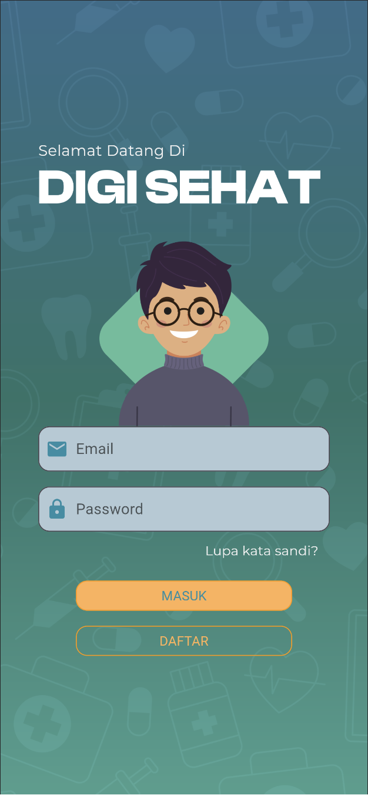

# TP2PROVIS2024

Nama : Muhamad Sabil Fausta
NIM : 2210142

## DigiSehat

### Deskripsi Aplikasi

DigiSehat adalah aplikasi rawat jalan yang memungkinkan pasien untuk mengakses layanan kesehatan dengan mudah dan efisien dari perangkat mobile mereka. Dengan fokus pada kenyamanan dan aksesibilitas, DigiSehat menyediakan solusi lengkap untuk kebutuhan rawat jalan, termasuk pendaftaran konsultasi dengan dokter, pemesanan obat, hingga pemantauan jadwal rawat jalan.

## Desain Mockup Aplikasi

https://www.figma.com/file/CkydjPvtYKKjSO9HtlRJEb/Provis?type=design&node-id=25-328&mode=design&t=CY948Jn2FHhZZaDb-0

## Halaman Aplikasi

Splash Screen

Halaman pembuka yang menampilkan nama aplikasi "DigiSehat" dengan latar belakang motif medis, memberikan kesan pertama yang profesional dan fokus pada kesehatan.

Login Page

Halaman login menyediakan formulir untuk masuk atau mendaftar. Didesain dengan intuitif untuk memastikan pengalaman pengguna yang lancar.

Home Page

Setelah login, pengguna diarahkan ke halaman utama yang berisi navigasi cepat ke fitur utama aplikasi seperti pencarian dokter, rumah sakit, pemesanan kamar, dan toko kesehatan.
